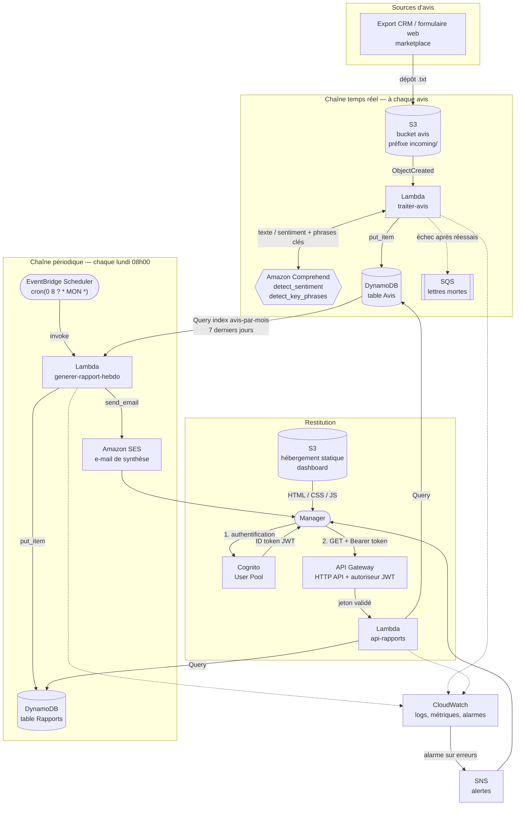

# Architecture technique

## 1. Vue d'ensemble



## 2. Les deux chaînes, et pourquoi elles sont séparées

Le projet repose sur deux traitements de nature différente. Les confondre est
l'erreur classique sur ce type de sujet.

**Chaîne temps réel (par avis).** Un avis arrive, il est analysé, il est stocké.
Le traitement est unitaire, déclenché par un événement, et son résultat n'a
presque aucune valeur métier pris isolément : savoir que l'avis `AV014` est
négatif n'aide personne à décider quoi que ce soit.

**Chaîne périodique (par semaine).** Une fois par semaine, l'ensemble des avis
de la période est relu pour produire une synthèse : proportions, tendance,
thèmes récurrents. C'est ce livrable-là qui répond à la problématique.

Les séparer apporte trois bénéfices concrets :

| | Chaîne temps réel | Chaîne périodique |
|---|---|---|
| Déclencheur | événement S3 | horloge (EventBridge Scheduler) |
| Fréquence | à chaque avis | 1 fois / semaine |
| Coût dominant | appels Comprehend | lectures DynamoDB (négligeables) |
| Rejouable ? | non (coûterait un nouvel appel Comprehend) | oui, gratuitement |

Ce dernier point est décisif : **le lexique de thèmes peut évoluer sans jamais
retraiter les avis**. On change une expression régulière, on relance la Lambda
d'agrégation, et tout l'historique est réinterprété. Si la détection de thèmes
avait été figée au moment de l'ingestion, chaque ajustement aurait imposé de
repasser l'intégralité du corpus dans Comprehend.

## 3. Détail des composants

### 3.1 S3 — dépôt des avis

Bucket `<pile>-avis-<compte>`, préfixe `incoming/`. Les métadonnées voyagent
dans le nom du fichier :

```
AV001_2026-08-17_CLI-1042.txt
└─┬──┘ └────┬───┘ └───┬────┘
avis_id   date     client_id
```

Le contenu du fichier est du texte brut, uniquement le corps de l'avis.
N'importe quel système amont peut donc alimenter le pipeline sans produire de
JSON structuré : un export CSV converti, un formulaire web, un scraping.

Une règle de cycle de vie purge `incoming/` après 90 jours. Le texte est déjà
persisté dans DynamoDB après analyse ; conserver le fichier brut plus longtemps
serait payer deux fois le même stockage.

### 3.2 Lambda `traiter-avis`

Déclenchée par `s3:ObjectCreated:*`, filtrée sur le préfixe `incoming/` et le
suffixe `.txt` — le filtre est posé côté S3, pas dans le code : une Lambda non
invoquée coûte zéro.

Deux appels Comprehend par avis :

- `detect_sentiment` → `POSITIVE`, `NEGATIVE`, `NEUTRAL` ou `MIXED`, avec les
  quatre probabilités associées ;
- `detect_key_phrases` → les groupes nominaux saillants de l'avis.

Gestion des erreurs à deux vitesses :

- **erreur définitive** (nom de fichier non conforme, fichier vide) : journalisée
  et ignorée. Réessayer donnerait le même résultat, et faire échouer le lot
  bloquerait les avis valides ;
- **erreur transitoire** (throttling Comprehend, indisponibilité DynamoDB) :
  propagée pour que Lambda réessaie, puis bascule vers la file SQS de lettres
  mortes. Une alarme CloudWatch surveille cette file.

### 3.3 DynamoDB — table `Avis`

| Attribut | Type | Rôle |
|---|---|---|
| `avis_id` | S | clé de partition |
| `date` | S | `AAAA-MM-JJ` |
| `mois` | S | `AAAA-MM`, clé de partition de l'index |
| `client_id` | S | |
| `texte` | S | avis original |
| `sentiment` | S | `POSITIVE` / `NEGATIVE` / `NEUTRAL` / `MIXED` |
| `score_confiance` | N | probabilité de la classe retenue |
| `scores_detail` | M | les quatre probabilités |
| `mots_cles` | L | phrases clés nettoyées |
| `fichier_source`, `date_traitement`, `langue` | S | traçabilité |

**Index secondaire global `avis-par-mois`** : partition `mois`, tri `date`.

Sans lui, l'agrégation hebdomadaire ferait un `Scan` — c'est-à-dire lire toute
la table, tout l'historique, à chaque exécution. Le coût et la latence
croîtraient indéfiniment alors que la fenêtre analysée reste de sept jours.

Pourquoi partitionner par mois plutôt que d'utiliser une partition unique ?
Une clé constante concentrerait toutes les écritures sur une seule partition
physique, qui plafonne à 1 000 unités d'écriture par seconde. Le seau mensuel
répartit la charge tout en gardant un `Query` sur plage de dates. Une fenêtre
de sept jours traverse au plus deux mois, donc au plus deux requêtes — c'est
le cas explicitement testé dans `tests/test_agregation.py`.

Facturation **à la demande** : le flux d'avis est trop irrégulier pour un mode
provisionné, et il n'y a aucune capacité à dimensionner à l'avance.

### 3.4 EventBridge Scheduler

`cron(0 8 ? * MON *)`, fuseau `Europe/Paris`, fenêtre d'exécution flexible
désactivée.

EventBridge **Scheduler** et non une règle EventBridge classique : le Scheduler
gère nativement les fuseaux horaires, y compris le passage heure d'été / heure
d'hiver. Une règle `cron` classique s'exprime obligatoirement en UTC — le
rapport arriverait à 9h en été et 8h en hiver.

La charge utile transmise (`{"jours": 7, "envoyer_email": true}`) est le même
format que celui utilisé pour l'invocation manuelle en démonstration : un seul
chemin de code, testé de la même façon en démo et en production.

### 3.5 Lambda `generer-rapport-hebdo`

Le cœur du projet. Trois étapes.

**Étape 1 — collecte.** Fenêtre glissante de 7 jours s'arrêtant la veille.
Lancée le lundi matin, elle couvre exactement le lundi au dimanche écoulés.

**Étape 2 — statistiques.** Comptage par classe de sentiment, pourcentages,
volume par jour, score de confiance moyen. La tendance est qualifiée de
`positive`, `negative` ou `mitigee` selon que l'écart entre positifs et négatifs
dépasse 15 points. Comparaison automatique avec le rapport de la semaine
précédente, s'il existe.

**Étape 3 — thèmes récurrents.** C'est l'étape qui distingue ce projet d'une
simple analyse de sentiment.

Comprehend extrait des phrases clés brutes : « le colis », « la porte cassée »,
« une charnière arrachée ». Trois formulations d'un même problème métier. Un
classement direct de ces phrases produirait une longue liste plate, illisible,
et surtout **incomparable d'une semaine à l'autre** — puisque les formulations
changent à chaque fois.

Le traitement se fait donc en deux temps :

1. **normalisation** (`nordichome.texte`) : minuscules, suppression des accents,
   l'apostrophe devient une espace, retrait des déterminants de tête. « L'accueil »,
   « les accueils », « un accueil » convergent vers `accueil` ;
2. **projection sur un lexique métier** (`nordichome.themes`) : six thèmes
   stables, chacun défini par une liste d'expressions régulières. Un avis peut
   porter plusieurs thèmes.

| Thème | Polarité attendue |
|---|---|
| Retards de livraison | négative |
| Colis et produits endommagés | négative |
| Service après-vente difficile à joindre | négative |
| Réactivité du service client | positive |
| Accueil en boutique | positive |
| Qualité des produits | positive |

**Point important.** La colonne « polarité attendue » ne sert qu'à l'affichage.
Le classement d'un thème dans le palmarès positif ou négatif s'appuie
exclusivement sur le sentiment réellement détecté par Comprehend pour l'avis
qui le porte. Un avis négatif mentionnant la qualité produit fera remonter
« Qualité des produits » côté négatif — et c'est précisément l'information utile.
Un test dédié verrouille ce comportement.

Les avis `NEUTRAL` et `MIXED` comptent dans le volume mais n'alimentent ni l'un
ni l'autre palmarès : sans polarité tranchée, les y ranger fausserait la lecture.

**Étape 4 — restitution.** Écriture dans DynamoDB puis envoi SES (HTML + texte).
Si l'envoi échoue — cas fréquent en bac à sable SES avec une adresse non
vérifiée — le rapport reste persisté et l'exécution n'est pas mise en échec.
Le statut de l'envoi est enregistré à côté du rapport.

### 3.6 DynamoDB — table `Rapports`

Clé de partition `semaine_id` (`2026-W34`, norme ISO 8601).

**Index secondaire `rapports-par-date`** : partition `type` (constante
`RAPPORT_HEBDO`), tri `date_generation`. La clé primaire donne l'accès direct à
une semaine précise ; l'index fournit la liste chronologique inversée que le
tableau de bord affiche, là encore sans `Scan`.

Ici la partition unique est assumée : on écrit un élément par semaine, soit 52
par an. Aucun risque de partition chaude.

### 3.7 API Gateway + Cognito

**HTTP API** plutôt que REST API : environ 70 % moins cher, latence plus faible,
et surtout **autoriseur JWT natif**. Aucune Lambda d'autorisation à écrire — la
passerelle valide elle-même la signature du jeton Cognito, vérifie l'émetteur,
l'audience et l'expiration. Une requête non authentifiée n'atteint jamais la
Lambda, donc ne coûte rien.

Le pool Cognito a `AllowAdminCreateUserOnly` activé : pas d'auto-inscription,
les comptes sont créés par un administrateur. C'est la traduction technique de
« accès manager uniquement ».

Le front présente l'**ID token** et non l'access token : l'audience (`aud`) d'un
jeton Cognito n'est portée que par l'ID token, or c'est sur elle que l'autoriseur
s'appuie.

| Route | Rôle |
|---|---|
| `GET /rapports?limite=12` | liste chronologique inversée |
| `GET /rapports/{semaine_id}` | rapport détaillé |
| `GET /avis?debut=&fin=&sentiment=` | avis unitaires, pour la vue de détail |

### 3.8 S3 — hébergement du tableau de bord

Bucket en `WebsiteConfiguration`, lecture publique. L'application est
statique : HTML, CSS et JavaScript sans étape de compilation ni dépendance
installée (Chart.js est chargé depuis un CDN).

Le bucket est public, mais **les données ne le sont pas** : le dashboard ne
contient aucune donnée, il les demande à l'API, qui exige un jeton valide. Ce
qui est public, c'est le code de la page — comme n'importe quel site web.

En production on placerait CloudFront avec Origin Access Control devant le
bucket : HTTPS, certificat, cache, et bucket entièrement privé. Cela a été
écarté ici pour rester dans le cadre du bac à sable, sans certificat ni domaine
à gérer.

### 3.9 CloudWatch

Journaux des trois fonctions, rétention 14 jours (volontairement courte : les
logs sont la première source de dépassement du free tier sur ce type de projet).

Trois alarmes, chacune reliée à un sujet SNS notifiant le manager par e-mail :

| Alarme | Déclencheur | Pourquoi |
|---|---|---|
| `erreurs-traiter-avis` | ≥ 1 erreur / 5 min | des avis ne sont pas analysés |
| `echec-rapport-hebdo` | ≥ 1 erreur / 5 min | le livrable hebdomadaire est manqué ; la Lambda ne tournant qu'une fois par semaine, il n'y a pas de seconde chance |
| `avis-non-traites` | ≥ 1 message en file de lettres mortes | des avis ont épuisé leurs réessais |

`TreatMissingData: notBreaching` sur les trois : sans invocation, la métrique
est simplement absente, ce n'est pas un incident.

## 4. Choix transverses

**Région unique `eu-west-1` (Irlande).** Amazon Comprehend **n'est pas disponible
à Paris (eu-west-3)** — les régions européennes qui le servent sont Irlande,
Londres et Francfort. Irlande est la plus complète et la moins chère des trois.
Une région unique évite tout transfert inter-régions, facturé et inutile ici.

**Runtime Python 3.12 sur architecture arm64 (Graviton).** Environ 20 % moins
cher à performance équivalente. Aucune dépendance native ne contraint
l'architecture, puisque les Lambdas n'ont aucune dépendance applicative.

**Aucune dépendance tierce.** `boto3` est fourni par le runtime Lambda ; toute
la logique repose sur la bibliothèque standard. Pas de couche de dépendances à
construire, pas de vulnérabilité à suivre, démarrage à froid minimal.

**Lambda Layer partagée.** `nordichome.texte`, `nordichome.themes`,
`nordichome.fichiers` et `nordichome.agregation` sont montés dans `/opt/python`
et partagés par les trois fonctions. La convention de nommage des fichiers est
ainsi définie à un seul endroit : le générateur du jeu de test et la Lambda
d'ingestion s'appuient sur le même module, ce qui rend impossible une divergence
entre écriture et lecture.

**Logique métier séparée des entrées-sorties.** `nordichome.agregation` ne
connaît ni boto3 ni les variables d'environnement. Conséquence directe : toute
la logique de calcul est testable hors ligne, et `scripts/simulation_locale.py`
produit un rapport complet sans qu'aucune ressource AWS n'existe.

**Dépendance circulaire CloudFormation contournée.** Le bucket d'avis référence
la Lambda (notification), la politique IAM de la Lambda référence le bucket :
`Bucket → Fonction → Rôle → Bucket`. CloudFormation refuse. Le nom du bucket est
donc calculé (`!Sub "${AWS::StackName}-avis-${AWS::AccountId}"`) plutôt que
référencé, ce qui rompt le cycle.

## 5. Estimation de coût

Hypothèse : 500 avis par mois, un rapport par semaine, une dizaine de
consultations du tableau de bord par semaine.

| Service | Volume mensuel | Free tier | Coût estimé |
|---|---|---|---|
| Comprehend | 1 000 unités (2 appels × 500 avis) | 50 000 unités / mois pendant 12 mois | 0 € puis ~0,25 € |
| Lambda | ~600 invocations | 1 M requêtes / mois, à vie | 0 € |
| DynamoDB à la demande | ~1 500 écritures, ~3 000 lectures | 25 Go de stockage | < 0,01 € |
| S3 | < 10 Mo | 5 Go pendant 12 mois | 0 € |
| API Gateway HTTP | ~500 requêtes | 1 M / mois pendant 12 mois | 0 € |
| Cognito | 1 utilisateur actif | 10 000 MAU | 0 € |
| SES | 4 e-mails | 3 000 messages / mois | 0 € |
| CloudWatch Logs | < 100 Mo | 5 Go | 0 € |
| EventBridge Scheduler | 4 invocations | 14 M / mois | 0 € |

**Total : nul en pratique sur la période du projet**, et de l'ordre de quelques
dizaines de centimes par mois une fois le free tier épuisé. Le poste dominant à
grande échelle est Comprehend, facturé par unité de 100 caractères — d'où
l'intérêt de ne jamais rejouer l'analyse unitaire, et de ne rejouer que
l'agrégation.

## 6. Limites connues

**Le lexique est écrit à la main.** Six thèmes couvrent le domaine de
NordicHome ; les transposer à un autre métier demande de les réécrire. C'est un
choix délibéré : sur 28 avis, un apprentissage non supervisé (LDA, clustering
d'embeddings) produirait des groupes instables et impossibles à nommer. Le
lexique donne des thèmes stables, comparables dans le temps, et explicables — ce
qui est exactement ce qu'attend un manager. La piste d'évolution est
`Comprehend Topic Modeling` au-delà de quelques milliers d'avis.

**Le lexique ne comprend pas la négation.** L'avis neutre `AV019` (« livrée dans
les délais annoncés ») déclenche le motif `délai` du thème « Retards de
livraison ». Cela reste sans conséquence ici, car le classement est filtré par
le sentiment : un avis neutre n'alimente aucun palmarès. Mais un avis franchement
négatif contenant « pas de retard » serait mal classé. C'est la limite principale
de l'approche par motifs.

**SES reste en bac à sable.** Seules des adresses vérifiées peuvent recevoir les
rapports. Suffisant pour la démonstration ; une sortie de bac à sable (demande
au support AWS) serait requise pour un usage réel.

**Le bucket du dashboard est public en HTTP.** Acceptable pour une page sans
données ; CloudFront + OAC serait la réponse en production.

**Une seule langue.** `LanguageCode='fr'` est figé. Comprehend propose
`detect_dominant_language` : un appel supplémentaire permettrait de router
automatiquement, au prix d'une unité facturée de plus par avis.
